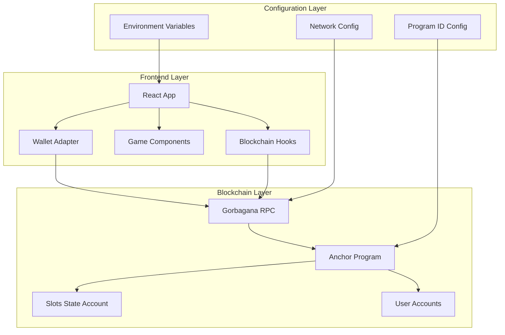

# Design Document

## Overview

The Gorbagana Slots dApp deployment design transforms the current demo-mode application into a fully functional blockchain-integrated game on the Gorbagana Testnet. The design maintains the existing game mechanics and user interface while replacing demo simulations with real blockchain interactions. The architecture follows a client-server model where the React frontend communicates with a Rust-based Anchor smart contract deployed on the Gorbagana blockchain.

The deployment strategy focuses on minimal configuration changes to preserve the existing codebase while enabling real blockchain functionality. The design ensures seamless transition from demo mode to live mode through environment-based configuration switching.

## Architecture

### High-Level Architecture



### Network Architecture

The dApp connects to the Gorbagana blockchain through the official RPC endpoint `https://rpc.gorbagana.wtf/`. This connection enables:

- Wallet authentication and balance queries
- Smart contract interaction for game logic
- Transaction submission and confirmation
- Event listening for game results

### Smart Contract Architecture

The Anchor program maintains a simple state structure:
- **SlotsState Account**: Stores game configuration, statistics, and treasury information
- **User Interactions**: Handle betting, spinning, and payout operations
- **Event Emission**: Provides real-time feedback to the frontend

## Components and Interfaces

### Frontend Components

#### 1. Wallet Integration Component
**Purpose**: Manages wallet connections and blockchain state
**Interface**:
```typescript
interface WalletManager {
  connect(): Promise<void>
  disconnect(): void
  getBalance(): Promise<number>
  isConnected: boolean
  publicKey: PublicKey | null
}
```

#### 2. Game Engine Component
**Purpose**: Orchestrates game logic and blockchain interactions
**Interface**:
```typescript
interface GameEngine {
  spin(betAmount: number): Promise<SpinResult>
  initializeGame(): Promise<void>
  getGameState(): Promise<GameState>
}
```

#### 3. Configuration Manager
**Purpose**: Handles environment-based configuration switching
**Interface**:
```typescript
interface ConfigManager {
  isLiveMode(): boolean
  getProgramId(): PublicKey
  getRpcEndpoint(): string
  getNetworkConfig(): NetworkConfig
}
```

### Smart Contract Interfaces

#### 1. Game State Management
```rust
pub struct SlotsState {
    pub authority: Pubkey,
    pub initialized: bool,
    pub treasury: Pubkey,
    pub total_spins: u64,
    pub total_payout: u64,
    pub house_edge: u8,
    pub max_payout_per_spin: u64,
    pub total_pool: u64,
    pub min_pool_threshold: u64,
}
```

#### 2. Game Operations
```rust
pub fn initialize(ctx: Context<Initialize>, authority: Pubkey, treasury: Pubkey) -> Result<()>
pub fn spin(ctx: Context<Spin>, bet_amount: u64) -> Result<()>
pub fn claim_payout(ctx: Context<ClaimPayout>, amount: u64) -> Result<()>
```

### API Interfaces

#### 1. Blockchain Interaction API
The frontend communicates with the blockchain through standardized Anchor program methods:

- **Initialize**: Sets up the game state for a new user
- **Spin**: Processes a bet and returns game results
- **Query State**: Retrieves current game statistics and configuration

#### 2. Event Handling API
Real-time game events are handled through Solana's event system:

- **SpinRequested**: Emitted when a user initiates a spin
- **SpinResult**: Emitted with game results and payout information
- **StateUpdate**: Emitted when game state changes

## Data Models

### Frontend Data Models

#### GameState Model
```typescript
interface GameState {
  isInitialized: boolean
  totalSpins: number
  totalPayout: number
  houseEdge: number
  maxPayoutPerSpin: number
  userBalance: number
  isConnected: boolean
}
```

#### SpinResult Model
```typescript
interface SpinResult {
  symbols: [number, number, number]
  payout: number
  transactionId: string
  timestamp: number
}
```

#### Configuration Model
```typescript
interface DeploymentConfig {
  programId: string
  rpcEndpoint: string
  walletPath: string
  isLiveMode: boolean
  networkType: 'testnet' | 'mainnet' | 'demo'
}
```

### Smart Contract Data Models

#### Account Structures
The smart contract uses Anchor's account system to manage state:

- **SlotsState**: Primary game state account
- **User**: Standard Solana user account for transactions
- **SystemProgram**: Solana system program for account management

#### Event Structures
```rust
#[event]
pub struct SpinRequested {
    pub user: Pubkey,
    pub bet_amount: u64,
    pub symbols: [u8; 3],
}

#[event]
pub struct SpinResult {
    pub user: Pubkey,
    pub symbols: [u8; 3],
    pub payout: u64,
}
```

## Error Handling

### Frontend Error Handling Strategy

#### 1. Network Errors
- **Connection Failures**: Retry mechanism with exponential backoff
- **RPC Timeouts**: User-friendly timeout messages with retry options
- **Invalid Responses**: Graceful degradation to demo mode if configured

#### 2. Wallet Errors
- **Connection Rejected**: Clear instructions for wallet setup
- **Insufficient Balance**: Prevent betting with helpful balance display
- **Transaction Rejected**: Detailed error messages with suggested actions

#### 3. Smart Contract Errors
- **Invalid Bet Amount**: Client-side validation with server-side confirmation
- **Contract Not Initialized**: Automatic initialization flow
- **Payout Failures**: Transaction retry mechanism with user notification

### Smart Contract Error Handling

#### Custom Error Types
```rust
#[error_code]
pub enum ErrorCode {
    #[msg("Invalid bet amount")]
    InvalidBetAmount,
    #[msg("Bet amount too high")]
    BetTooHigh,
    #[msg("Invalid amount")]
    InvalidAmount,
    #[msg("Insufficient pool funds")]
    InsufficientPoolFunds,
    #[msg("Game not initialized")]
    GameNotInitialized,
}
```

#### Error Recovery Mechanisms
- **Automatic Retry**: For transient network issues
- **Graceful Degradation**: Fallback to demo mode when appropriate
- **User Notification**: Clear error messages with actionable steps

## Testing Strategy

### Frontend Testing Approach

#### 1. Unit Testing
- **Component Testing**: React Testing Library for UI components
- **Hook Testing**: Custom hooks for blockchain interactions
- **Utility Testing**: Configuration and helper functions

#### 2. Integration Testing
- **Wallet Integration**: Mock wallet providers for testing
- **Blockchain Interaction**: Testnet integration tests
- **End-to-End**: Cypress tests for complete user flows

#### 3. Performance Testing
- **Load Testing**: Multiple concurrent users
- **Network Testing**: Various network conditions
- **Memory Testing**: Long-running sessions

### Smart Contract Testing Strategy

#### 1. Unit Testing
- **Function Testing**: Individual contract methods
- **State Testing**: Account state management
- **Error Testing**: Error condition handling

#### 2. Integration Testing
- **Client Integration**: Frontend-contract interaction
- **Network Testing**: Gorbagana testnet deployment
- **Security Testing**: Common attack vectors

#### 3. Deployment Testing
- **Testnet Deployment**: Full deployment verification
- **Configuration Testing**: Various deployment configurations
- **Rollback Testing**: Deployment failure recovery

### Testing Environment Setup

#### Local Development
- **Solana Test Validator**: Local blockchain simulation
- **Mock Wallets**: Simulated wallet interactions
- **Test Tokens**: Local test token minting

#### Testnet Testing
- **Gorbagana Testnet**: Real network testing
- **Test Wallets**: Funded testnet wallets
- **Monitoring**: Transaction and error monitoring

## Deployment Architecture

### Build Process

#### 1. Smart Contract Build
```bash
# Anchor build process
anchor build
anchor deploy --provider.cluster https://rpc.gorbagana.wtf/
```

#### 2. Frontend Build
```bash
# Vite build process
npm run build
# Static file generation for hosting
```

#### 3. Configuration Update
- **Program ID Extraction**: From deployment output
- **Configuration File Updates**: Automated script updates
- **Environment Variable Setup**: Production configuration

### Deployment Pipeline

#### 1. Pre-deployment Validation
- **Code Quality**: Linting and formatting checks
- **Security Audit**: Basic security validation
- **Test Suite**: Complete test execution

#### 2. Smart Contract Deployment
- **Network Configuration**: Gorbagana RPC setup
- **Wallet Configuration**: Deployment wallet setup
- **Contract Deployment**: Anchor deployment process
- **Verification**: Deployment success confirmation

#### 3. Frontend Deployment
- **Configuration Update**: Program ID and network settings
- **Build Process**: Production build generation
- **Static Hosting**: Web server deployment
- **CDN Setup**: Optional content delivery network

#### 4. Post-deployment Validation
- **Functionality Testing**: End-to-end testing on live deployment
- **Performance Monitoring**: Response time and error rate monitoring
- **User Acceptance**: Basic user flow validation

### Infrastructure Requirements

#### Development Environment
- **Node.js 16+**: JavaScript runtime
- **Rust/Cargo**: Smart contract compilation
- **Solana CLI**: Blockchain interaction tools
- **Anchor CLI**: Smart contract framework

#### Production Environment
- **Web Server**: Static file hosting (Nginx, Apache, or CDN)
- **SSL Certificate**: HTTPS encryption
- **Domain Name**: Custom domain configuration
- **Monitoring**: Application performance monitoring

#### Network Requirements
- **Gorbagana RPC Access**: Reliable connection to blockchain
- **Wallet Provider Support**: Integration with popular wallets
- **CORS Configuration**: Cross-origin resource sharing setup